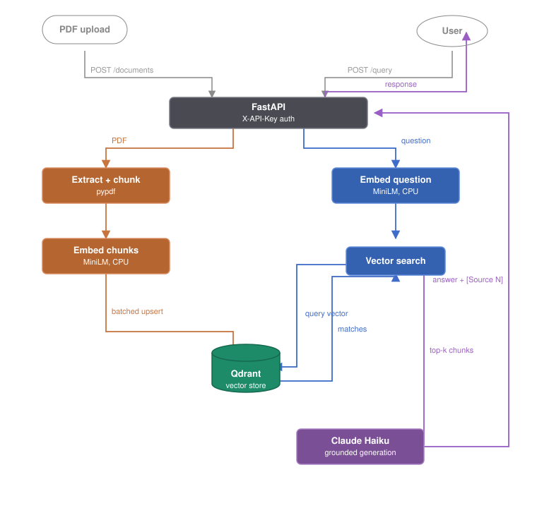

# Document Brain

> Production RAG API for document Q&A with source citations.

[](https://github.com/Prateek718/document-brain/actions/workflows/ci.yml)
[](https://www.python.org/downloads/)
[](https://github.com/astral-sh/ruff)
[](LICENSE)

**Live demo:** https://document-brain.onrender.com

> Free-tier hosting — the first request after an idle period takes ~30s while the instance wakes. Subsequent requests are fast.

## Overview

Document Brain answers questions about a corpus of PDFs and cites the source passages behind every answer. Upload documents, ask a question, and get a response grounded in the retrieved text with page-level citations — not a free-floating LLM guess. It is a complete retrieval-augmented generation service: ingestion, embedding, vector search, generation, auth, and a minimal web client, deployed and running.

## Architecture



Both paths run through FastAPI behind `X-API-Key` auth (`/query` and `/documents`). A query is embedded, the embedding drives a similarity search in Qdrant, the top chunks are passed to the LLM as grounding context, and the model returns an answer with inline `[Source N]` citations. Ingestion runs the reverse — extract, chunk, embed, and batch-upsert into the same store.

Embeddings use a local CPU model (sentence-transformers MiniLM), so retrieval has no per-query API cost; only generation calls out to the LLM. The vector store is a managed Qdrant cluster, keeping the storage backend separate from the application and swappable.

## Tech stack

Python 3.12 · FastAPI · Qdrant (vector store) · sentence-transformers / all-MiniLM-L6-v2 · Claude Haiku · Docker · deployed on Render. Tooling: uv, ruff, mypy (strict), pytest, GitHub Actions CI.

## Quick start

Requires [Docker](https://docs.docker.com/get-docker/) and a `.env` file:

```
QDRANT_URL=<your qdrant url>
QDRANT_API_KEY=<your qdrant key>
ANTHROPIC_API_KEY=<your anthropic key>
API_KEY=<a random secret, 32+ chars, for the X-API-Key header>
```

Then:

```bash
docker compose up --build
```

The API is at `http://localhost:8000` and the web client at `http://localhost:8000/`. `/health` is open; `/query` and `/documents` require the `X-API-Key` header.

```bash
curl -X POST http://localhost:8000/query \
  -H "X-API-Key: $API_KEY" -H "Content-Type: application/json" \
  -d '{"question": "What is displacement?"}'
```

## Key engineering decisions

- **Concurrency:** load testing (Locust) showed the async event loop blocked by CPU-bound embedding; offloading it to a threadpool cut median latency ~48% (3.1s → 1.6s) and roughly doubled throughput.
- **Capacity:** staged ramp testing located the saturation knee at ~50–60 concurrent users on a 6-core machine — beyond which the embedder is the bottleneck — with graceful degradation, no failures.
- **Pre-deploy security audit:** triaged findings into fix-now vs. documented; hardened API-key auth (constant-time compare), early upload size limits, prompt-injection separation, and fail-loud config.
- **Vector ID correctness:** point IDs are deterministic UUIDs; an integration test runs against a real Qdrant (CI service container) to catch contract mismatches the in-memory test client silently tolerates.
- **Bulk ingestion:** upserts are batched after a single large request (a ~14k-chunk book) exceeded Qdrant's request limit and dropped the connection.

## Known limitations

These are conscious scope decisions for a portfolio demo, not oversights — each has a clear production answer.

- **Single-tenant:** one shared API key, one collection; no per-user isolation. Production would add tenant namespacing and per-key access.
- **No delete endpoint:** the API ingests and queries but does not remove documents. Intentional for the demo; a real document lifecycle needs delete/update.
- **Ingestion vs. serving:** the 512 MB deploy tier holds the model at rest but cannot bulk-embed a large corpus in-process (it OOMs). Large ingestion runs locally (see `scripts/`); production would move ingestion to a separate worker.
- **Cold starts:** free-tier instances spin down when idle, so the first request after a pause is slow.

## License

MIT
